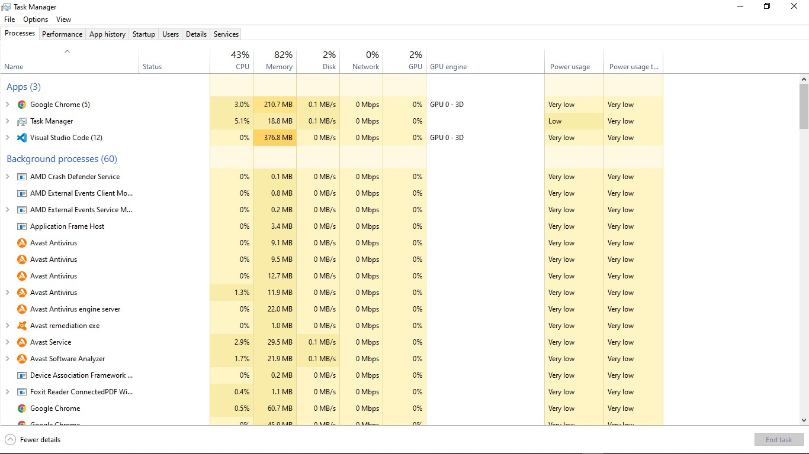

# Komponen Sistem Operasi
- <b>Apa Itu Komponen Sistem Operasi?</b>

Komponen adalah rangkaian yang ada didalam suatu sistem. Membahas komponen-komponen yang diperlukan dalam suatu sistem operasi komputer. Tidak semua sistem operasi memiliki struktur yang sama.

Terdapat tiga elemen dasar yang membangun   perancangan   sistem operasi secara umum. Komponen- komponen ini dapat disebut modular karena memiliki fungsi yang berbeda dan  dapat dikembangkan  secara terpisah. Ketiga bagian tersebut antara lain:

1.User Interface

2.Kernel

3.Sistem manajemen file

Pada kenyataannya tidak semua sistem operasi mempunyai struktur yang sama. Namun menurut Avi Silberschatz, Peter Galvin, dan Greg Gagne, umumnya sebuah sistem operasi modern mempunyai komponen sebagai berikut:

- Managemen Proses
- Managemen Memori Utama
- Managemen Secondary-Storage
- Managemen Sistem I/O.

4 Komponen Tambahan : 

- Managemen Penyimpanan Sekunder.
- Manajemen Sistem Proteksi.
- Manajemen Jaringan.
- Command-Interpreter system.

## Managemen Proses

Proses adalah keadaan ketika sebuah program sedang di eksekusi. Sebuah proses membutuhkan beberapa sumber daya untuk menyelesaikan tugasnya. sumber daya tersebut dapat berupa CPU time, memori, berkas-berkas, dan perangkat-perangkat I/O.
Sistem operasi bertanggung jawab atas aktivitas-aktivitas yang berkaitan dengan managemen proses seperti:

- Pembuatan dan penghapusan proses pengguna dan sistem proses.
- Menunda atau melanjutkan proses
- Menyediakan mekanisme untuk proses sinkronisasi.
- Menyediakan mekanisme untuk proses komunikasi.
- Menyediakan mekanisme untuk penanganan deadlock.

## Managemen Memori Utama

Memori utama atau lebih dikenal sebagai memori adalah sebuah array yang besar dari word atau byte, yang ukurannya mencapai ratusan, ribuan, atau bahkan jutaan. Setiap word atau byte mempunyai alamat tersendiri. Memori Utama berfungsi sebagai tempat penyimpanan yang akses datanya digunakan oleh CPU atau perangkat I/O. Memori utama termasuk tempat penyimpanan data yang sementara (volatile), artinya data dapat hilang begitu sistem dimatikan.
Sistem operasi bertanggung jawab atas aktivitas-aktivitas yang berkaitan dengan managemen memori seperti:

- Menjaga track dari memori yang sedang digunakan dan siapa yang
menggunakannya.
- Memilih program yang akan di-load ke memori.
- Mengalokasikan dan meng-dealokasikan ruang memori sesuai kebutuhan.

## Managemen Secondary-Storage

Data yang disimpan dalam memori utama bersifat sementara dan jumlahnya sangat kecil. Oleh karena itu, untuk meyimpan keseluruhan data dan program computer dibutuhkan secondary-storage yang bersifat permanen dan mampu menampung banyak data. Contoh dari secondary-storage adalah harddisk, disket, dll.
Sistem operasi bertanggung-jawab atas aktivitas-aktivitas yang berkaitan dengan disk-management seperti: free-space management, alokasi penyimpanan, penjadualan disk.

## Managemen Sistem I/O

Sering disebut device manager. Menyediakan “device driver” yang umum sehingga operasi I/O dapat seragam (membuka, membaca, menulis, menutup). Contoh: pengguna menggunakan operasi yang sama untuk membaca berkas pada hard-disk, CD-ROM dan floppy disk.

<b align="justify">Komponen Sistem Operasi untuk sistem I/O:</b>

- Buffer: menampung sementara data dari/ ke perangkat I/O.
- Spooling: melakukan penjadualan pemakaian I/O sistem supaya lebih efisien.
- Menyediakan driver untuk dapat melakukan operasi “rinci” untuk perangkat keras I/O tertentu.

## Managemen Penyimpanan Sekunder

Penyimpanan Sekunder adalah kumpulan informasi yang berhubungan sesuai dengan tujuan pembuat berkas tersebut. Berkas dapat mempunyai struktur yang bersifat hirarkis (direktori, volume, dll.). Sistem operasi bertanggung-jawab:

- Pembuatan dan penghapusan berkas.
- Pembuatan dan penghapusan direktori.
- Mendukung manipulasi berkas dan direktori.
- Memetakan berkas ke secondary storage.
- Mem-backup berkas ke media penyimpanan yang permanen (non-volatile).

## Managemen Sistem Proteksi

Sistem Proteksi mengacu pada mekanisme untuk mengontrol akses yang dilakukan oleh program, prosesor, atau pengguna ke sistem sumber daya. Mekanisme proteksi harus:

- membedakan antara penggunaan yang sudah diberi izin dan yang belum.
- menentukan kontrol yang akan dikenakan.
- menyediakan sarana penegakan.

## Managemen Jaringan

Sistem terdistribusi adalah sekumpulan prosesor yang tidak berbagi memori atau clock. Tiap prosesor mempunyai memori sendiri. Prosesor-prosesor tersebut terhubung melalui jaringan komunikasi Sistem terdistribusi menyediakan akses pengguna ke bermacam sumber-daya sistem. Akses tersebut menyebabkan:

- Percepatan komputasi.
- Peningkatan ketersediaan data.
- Keandalan yang ditingkatkan.

## Command-Interpreter System

Sistem Operasi menunggu instruksi dari pengguna (command driven). Program yang membaca instruksi dan mengartikan control statements umumnya disebut: control-card interpreter, command-line interpreter, dan UNIX shell.
Command-Interpreter System sangat bervariasi dari satu sistem operasi ke system operasi yang lain dan disesuaikan dengan tujuan dan teknologi I/O devices yang ada. Contohnya: CLI, Windows, Pen-based (touch), dan lain-lain.

# Layanan Sistem Operasi

Eksekusi program adalah kemampuan sistem untuk “load” program ke memori dan menjalankan program. Operasi I/O: pengguna tidak dapat secara langsung mengakses sumber daya perangkat keras, sistem operasi harus menyediakan mekanisme untuk melakukan operasi I/O atas nama pengguna. Sistem manipulasi berkas dalah kemampuan program untuk operasi pada berkas (membaca, menulis, membuat, and menghapus berkas). Komunikasi adalah pertukaran data/ informasi antar dua atau lebih proses yang berada pada satu komputer (atau lebih).
Deteksi error adalah menjaga kestabilan sistem dengan mendeteksi “error”, perangkat keras mau pun operasi.

Layanan sistem operasi dirancang untuk membuat pemrograman menjadi lebih mudah.
 

- <b>Pembuatan Program:</b> Sistem operasi menyediakan berbagai fasilitas yang membantu programer dalam membuat program seperti editor. Walaupun bukan bagian dari sistem operasi, tapi layanan ini diakses melalui sistem operasi. 
- <b>Eksekusi Program:</b> Sistem harus bisa me-load program ke memori, dan menjalankan program tersebut. Program harus bisa menghentikan pengeksekusiannya baik secara normal maupun tidak (ada error). 
-<b> Operasi Masukan/Keluaran</b>. Program yang sedang dijalankan kadang kala membutuhkan Masukan/Keluaran. Untuk efisiensi dan keamanan, pengguna biasanya tidak bisa mengatur peranti Masukan/Keluaran secara langsung, untuk itulah sistem operasi harus menyediakan mekanisme dalam melakukan operasi Masukan/Keluaran.
- <b>Manipulasi Sistem Berkas</b>. Program harus membaca dan menulis berkas, dan kadang kala juga harus membuat dan menghapus berkas. 
- <b>Komunikasi</b>. Kadang kala sebuah proses memerlukan informasi dari proses yang lain. Ada dua cara umum dimana komunikasi dapat dilakukan. Komunikasi dapat terjadi antara proses dalam satu komputer, atau antara proses yang berada dalam komputer yang berbeda, tetapi dihubungkan oleh jaringan komputer. Komunikasi dapat dilakukan dengan share-memory atau message-passing, dimana sejumlah informasi dipindahkan antara proses oleh sistem operasi. 
- <b>Deteksi Error</b>. Sistem operasi harus selalu waspada terhadap kemungkinan error. Error dapat terjadi di CPU dan memori perangkat keras, Masukan/Keluaran, dan di dalam program yang dijalankan pengguna. Untuk setiap jenis error sistem operasi harus bisa mengambil langkah yang tepat untuk mempertahankan jalannya proses komputasi. Misalnya dengan menghentikan jalannya program, mencoba kembali melakukan operasi yang dijalankan, atau melaporkan kesalahan yang terjadi agar pengguna dapat mengambil langkah selanjutnya. 

## Layanan Sistem Operasi : Mempertahankan Efisiensi Sistem

- <b>Alokasi Sumber Daya</b>. Ketika beberapa pengguna menggunakan sistem atau beberapa program dijalankan secara bersamaan, sumber daya harus dialokasikan bagi masing-masing pengguna dan program tersebut. 
- <b>Accounting</b>. Kita menginginkan agar jumlah pengguna yang menggunakan sumber daya, dan jenis sumber daya yang digunakan selalu terjaga. Untuk itu maka diperlukan suatu perhitungan dan statistik. Perhitungan ini diperlukan bagi seseorang yang ingin merubah konfigurasi sistem untuk meningkatkan pelayanan. 
- <b>Proteksi</b>. Layanan proteksi memastikan bahwa segala akses ke sumber daya terkontrol. Dan tentu saja keamanan terhadap gangguan dari luar sistem tersebut. Keamanan bisa saja dilakukan dengan terlebih dahulu mengidentifikasi pengguna. Ini bisa dilakukan dengan meminta password bila ingin menggunakan sumber daya. 

## System Program

System program menyediakan lingkungan yang memungkinkan pengembangan program dan eksekusi berjalan dengan baik. Dapat dikategorikan:

- <b>Manajemen/manipulasi berkas</b>. Membuat, menghapus, copy, rename, print, memanipulasi berkas dan direktori.
- <b>Informasi status</b>. Beberapa program meminta informasi tentang tanggal, jam, jumlah memori dan disk yang tersedia, jumlah pengguna dan informasi lain yang sejenis.
- <b>Modifikasi berkas</b>. Membuat berkas dan memodifikasi isi berkas yang disimpan pada disk atau tape. 
- <b>Pendukung bahasa pemrograman</b>. Kadang kala kompilator, assembler, interpreter dari bahasa pemrograman diberikan kepada pengguna dengan bantuan sistem operasi. 
- <b>Loading dan eksekusi program</b>. Ketika program di-assembly atau dikompilasi, program tersebut harus di-load ke dalam memori untuk dieksekusi. Untuk itu sistem harus menyediakan absolute loaders, relocatable loaders, linkage editors, dan overlay loaders. 
- <b>Komunikasi</b> Menyediakan mekanisme komunikasi antara proses, pengguna, dan sistem komputer yang berbeda. Sehingga pengguna bisa mengirim pesan, browse web pages, mengirim e-mail, atau mentransfer berkas. 

Umumnya sistem operasi dilengkapi oleh system-utilities atau program aplikasi yang di dalamnya termasuk web browser, word prossesor dan format teks, sistem database, games. System program yang paling penting adalah command interpreter yang mengambil dan menerjemahkan user-specified command selanjutnya.
 

# System Call

System call menyediakan interface antara program (program pengguna yang berjalan) dan bagian OS. System call menjadi jembatan antara proses dan system operasi. System call ditulis dalam bahasa assembly atau bahasa tingkat tinggi yang dapat mengendalikan mesin (C). Contoh: UNIX menyediakan system call: read, write => operasi I/O untuk berkas. Sering pengguna program harus memberikan data (parameter) ke OS yang akan dipanggil.

Tiga metode umum yang digunakan dalam memberikan parameter kepada sistem operasi: 

- Melalui register. 
- Menyimpan parameter dalam block atau tabel pada memori dan alamat block tersebut diberikan  sebagai parameter dalam register.
- Menyimpan parameter (push) ke dalam stack oleh program, dan melakukan pop off pada stack  oleh sistem operasi

## Jenis System Call

- <b>System calls</b> yang berhubungan dengan kontrol proses antara lain ketika penghentian pengeksekusian program. Baik secara normal (end) maupun tidak normal (abort). 
- Selama proses dieksekusi kadang kala diperlukan untuk me-load atau mengeksekusi program lain, disini diperlukan lagi suatu system calls. Juga ketika membuat suatu proses baru dan menghentikan sebuah proses. Ada juga system calls yang dipanggil ketika kita ingin meminta dan merubah atribut dari suatu proses. 
- MS-DOS adalah contoh dari sistem single-tasking. MS-DOS menggunakan metoda yang sederhana dalam menjalankan program aan tidak menciptakan proses baru. Program di-load ke dalam memori, kemudian program dijalankan. Berkeley Unix adalah contoh dari sistem multi-tasking. Command Interpereter masih tetap bisa dijalankan ketika program lain dieksekusi. 

<b>Eksekusi MS-DOS</b>

## System Call Managemen Proses

- System Call untuk manajemen proses diperlukan untuk mengatur proses-proses yang sedang berjalan. Kita dapat melihat penggunaan system calls untuk manajemen proses pada Sistem Operasi Unix. Contoh yang paling baik untuk melihat bagaimana system call bekerja untuk manajemen proses adalah Fork. Fork adalah satu satunya cara untuk membuat sebuah proses baru pada sistem Unix. Fork membuat duplikasi yang mirip dengan proses aslinya, termasuk file descriptor, register, dan lainnya. 
- Setelah perintah Fork, child akan mengeksekusi kode yang berbeda dengan parentnya. Bayangkan yang terjadi pada shell. Shell akan membaca command dari terminal, melakukan fork pada child, menunggu child untuk mengeksekusi command tersebut, dan membaca command lainnya ketika child terminate. 
- Untuk menunggu child selesai, parent akan mengeksekusi system call waitpid, yang hanya akan menunggu sampai child selesai. Proses child harus mengeksekusi command yang dimasukkan oleh user(pada kasus shell). Proses child melakukannya dengan menggunakan system call exec. 
- Dari ilustrasi tersebut kita dapat mengetahui bagaimana system call dipakai untuk manajemen proses. Kasus lainnya bukan hanya pada Fork, tetapi hampir setiap proses memerlukan system call untuk melakukan manajement proses. 

## System Call Managemen Berkas

- System calls yang berhubungan dengan berkas sangat diperlukan. Seperti ketika kita ingin membuat atau menghapus suatu berkas. Atau ketika ingin membuka atau menutup suatu berkas yang telah ada, membaca berkas tersebut, dan menulis berkas itu. System calls juga diperlukan ketika kita ingin mengetahui atribut dari suatu berkas atau ketika kita juga ingin merubah atribut tersebut. Yang termasuk atribut berkas adalah nama berkas, jenis berkas, dan lain-lain. 
- Ada juga system calls yang menyediakan mekanisme lain yang berhubungan dengan direktori atau sistim berkas secara keseluruhan. Jadi bukan hanya berhubungan dengan satu spesifik berkas. Contohnya membuat atau menghapus suatu direktori, dan lain-lain. 

## System Call Managemen Piranti

- Program yang sedang dijalankan kadang kala memerlukan tambahan sumber daya. Jika banyak pengguna yang menggunakan sistem, maka jika memerlukan tambahan sumber daya maka harus meminta peranti terlebih dahulu. Dan setelah selesai penggunakannnya harus dilepaskan kembali. Ketika sebuah peranti telah diminta dan dialokasikan maka peranti tersebut bisa dibaca, ditulis, atau direposisi. 

## System Call Informasi/Pemeliharaan

- Beberapa system calls disediakan untuk membantu pertukaran informasi antara pengguna dan sistem operasi. Contohnya system calls untuk meminta dan mengatur waktu dan tanggal. Atau meminta informasi tentang sistem itu sendiri, seperti jumlah pengguna, jumlah memori dan disk yang masih bisa digunakan, dan lain-lain. Ada juga system calls untuk meminta informasi tentang proses yang disimpan oleh sistem dan system calls untuk merubah (reset) informasi tersebut. 

## System Call Komunikasi

Dua model komunikasi:
- <b>Message-passing</b>. Pertukaran informasi dilakukan melalui fasilitas komunikasi antar proses yang 
disediakan oleh sistem operasi.
- <b>Shared-memory</b>. Proses menggunakan memori yang bisa digunakan oleh berbagai proses untuk pertukaran informasi dengan membaca dan menulis data pada memori tersebut.

Dalam message-passing, sebelum komunikasi dapat dilakukan harus dibangun dulu sebuah koneksi. Untuk itu diperlukan suatu system calls dalam pengaturan koneksi tersebut, baik dalam menghubungkan koneksi tersebut maupun dalam memutuskan koneksi tersebut ketika komunikasi sudah selesai dilakukan. Juga diperlukan suatu system calls untuk membaca dan menulis pesan (message) agar pertukaran informasi dapat dilakukan. 

# Contoh Sistem Operasi Yang ada Pada Laptop Saya

## Komponen Sistem Operasi

Untuk Contoh pertama adalah <b>Manajemen Proses</b>, Manajemen Proses disini menampilkan software apa saja yang sedang berjalan di laptop saya contohnya seperti Chrome, Visual studio dll. Menampilkan juga Berapa persen ruang Cpu, Ram , GPU yang digunakan software sedang saya jalankan.

Untuk contoh kedua adalah <b>Manajemen File Berkas</b> disini berguna untuk  mengelola file data dalam sistem komputer. Manajemen file menangani bagaimana file diatur, bukan hanya sekadar mengorganisir cara menyimpan saja. Tetapi digunakan untuk operasi pemeliharaan atau pengaturan file.

- Lalu Bagaimana cara membuat File / Folder?

Untuk Step pertama seperti gambar diatas kita bisa memilih bagian New Folder

Lalu seperti gambar diatas setelah mengklik New Folder maka akan muncul folder baru, kita akan disuruh memberikan nama pada folder tersebut.

Lalu bagaimana kita menghapus folder yang sudah kita bikin tadi? Perhatikan gambar diatas kita cukup memilih kolom dibagian delate maka folder tersebut akan terhapus.

Untuk Contoh ketiga disini ada <b>Sistem input/Output</b>, disini saya memberikan contoh berupa sistem input/Output. Manajemen perangkat Input/Output merupakan aspek perancangan sistemoperasi  terluas  dan  kompleks  karena  sangat  beragamnya  perangkat dan aplikasinya. Dalam  sistem  komputer  manajemen  i/o  sangat  diperlukan karena  i/o  adalah  sarana  user  untuk  bisa  berkomunikasi  dengan  komputer. Contoh sistem i/o yang ada dilaptop saya sekrang seperti <b>Keyboard, Mouse dan Speaker.</b> 

## Layanan Sistem Operasi

- **Deteksi Error**

Untuk contoh pertama disini ada deteksi error, jadi disini saya ingin mengganti nama file word laporan praktikum basis data, tapi file tersebut sedang saya buka. Maka jika saya mengganti nama file tersebut lewat file explorer akan muncul pop up error atau file tidak bisa diganti karna sedang digunakan, Dapat dilihat seperti gambar dibawah.

- **Manipulasi Program**

Contoh Kedua ada <b>Memanipulasi Program,</b> disini menggunakan notepad untuk membuat program bisa dilihat seperti gambar dibawah. 

Gambar diatas adalah pembuatan file notepad, Lalu berikutnya bisa dilihat gambar dibawah. Gambar dibawah detail informasi dari kapan kita Membuat, Memodifikasi dan Akses.

Gambar adalah dibawah adalah contoh saat kita memodifikasi file tersebut.

 
 - **Sistem Proteksi** 

Untuk contoh ketiga adalah <b>Sistem Proteksi,</b> disini latop saya menggunakan security key berupa password, jadi karna laptop saya tidak bisa Screenshot 
saat dalam kondisi terkunci maka gambar dibawah adalah contoh Pengaturan dari proteksi keamanan laptop saya.

## System Call

Untuk yang pertama saya mencontohkan cara membuka aplikasi lewat CMD, contohnya seperti gambar dibawah.

Setelah menekan enter maka aplikasi akan langsung terbuka seperti gambar dibawah.

Contoh berikutnya, cara membuat folder lewat CMD

Setelah kita menekan enter maka folder yang sudah kita buat lewat CMD tadi akan langsung muncul di Driver yang kita pilih tadi, misalkan membuat di D maka akan muncul di D jika membuat di C akan muncul di C.

 Unruk yang ketiga disini saya memberikan contoh <b>System Call Informasi/Pemeliharaan</b> dengan meminta informasi berapa jumlah partisi C saya yang telah digunakan dan ruang yang masih tersedia. Contohnya seperti gambah dibawah 

Cara menceknya kita bisa membuka file explorer lalu mengklik kanan Partisi D atau C, lalu pilih Properties.

