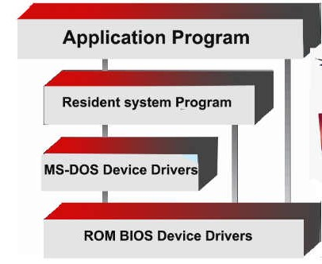
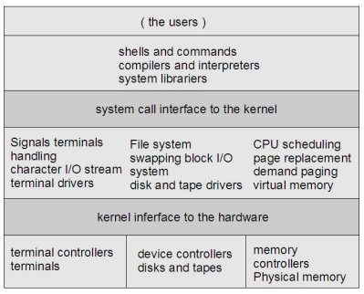
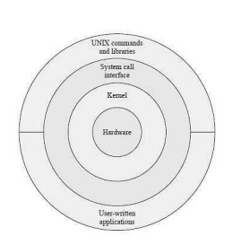
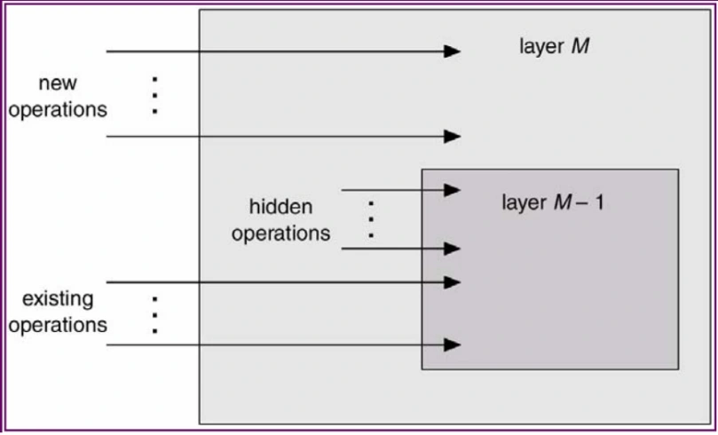
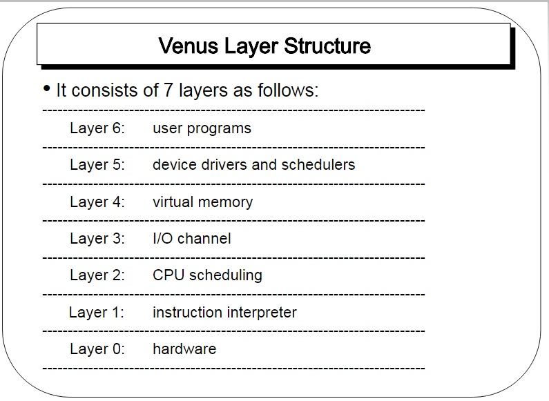
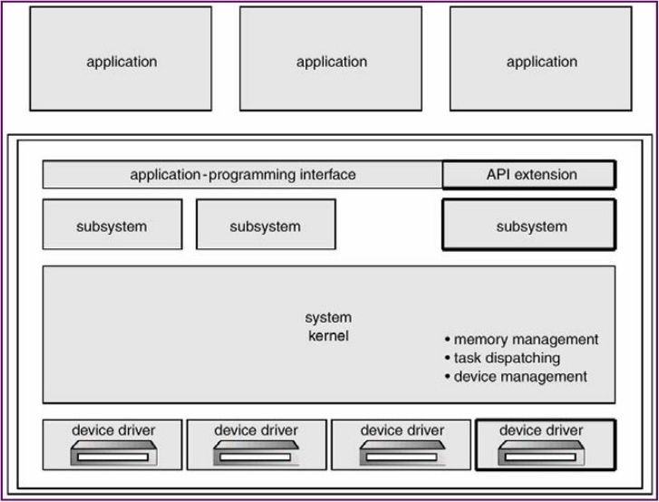
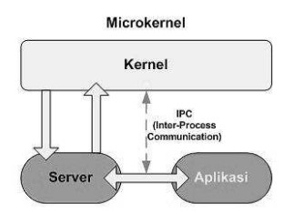
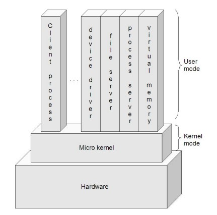

# Tugas 4 Sistem Operasi
## Sopia Refaldi
## 2110131110004

<b>Struktur Sistem Operasi</b>

Sistem operasi modern adalah suatu sistem yang besar dan kompleks. Dan tentu saja proses mendesain
sistem operasi bukanlah pekerjaan mudah. Karena itu, didalam desain sistem operasi digunakan
suatu struktur agar sistem tersebut bisa dipelajari dengan mudah. digunakan, dan dikembangkan
ebih lanjut. Jika pada bab sebelumnya, kita memandang sistem operasi dari luar, yaitu dengan
system call yang bisa digunakan, maka dalam bab ini kita akan melihat dari dalam, yaitu bagaimana
sistem operasi disusun. Ternyata, ada beberapa pendekatan/model yang digunakan seperti : 

- Struktur sederhana

- Struktur berlapis 

- Mikro kernel.

## Struktur Sederhana

Pada awalnya, sistem operasi dimulai sebagai sistem yang kecil, sederhana, dan terbatas. Lama
kelamaan, sistem operasi semakin berkembang menjadi suatu sistem yang lebih besar dari awalnya.
Dalam perkembangannya, ada sistem yang terstruktur dengan kurang baik, dan ada juga yang baik. Struktur sistem operasi ini yang
menyediakan fungsional dalam ruang yang sedikit sehingga tidak dibagi
menjadi beberapa modul, inisialisasinya terbatas pada fungsional perangkat keras yang terbagi menjadi dua bagian yaitu
kernel dan sistem program. Kernel terbagi
menjadi serangkaian interface dan device
driver dan menyediakan sistem file,
penjadwalan CPU, manajemen memori, dan
fungsi-fungsi sistem operasi lainnya melalui
system call.

Contoh sistem operasi yang memiliki struktur sederhana adalah MSDOS dan
UNIX.

- MSDOS

MSDOS menggunakan sistem operasi single tasking. Yaitu CPU
menyelesaikan satu proses sampai selesai dan tidak dapat disisipi proses lain.
Selain itu MSDos juga bersifat single mode yaitu tanpa proteksi perangkat
keras. Dalam MSDos, perintah internal telah dimasukkan ke dalam
command.com (interpreter perintah DOS), sehingga dapat langsung
dieksekusi oleh kernel DOS dimana saja. Sedangkan perintah eksternal tidak
dimasukkan ke dalam command.com, dan membutuhkan sebuah berkas yang
dapat dieksekusi (berupa program DOS) yang harus terdapat dalam direktori
aktif.

<b>Contoh Struktur pada MSDOS</b>

- UNIX

UNIX adalah sistem operasi yang terdiri dari 2 bagian penting yaitu Kernel
dan program sistem. Kernel UNIX berisi sistem file, penjadwalan CPU,
manajemen memori dan system call. Sedangkan program sistem bertugas
memanggil fungsi yang ada pada kernel. Sejak awal UNIX dirancang untuk
mendukung multitasking yakni dapat mengerjakan lebih dari satu tugas pada
waktu yang bersamaan. Misalnya membuka beberapa shell dan mengerjakan
tugas-tugas berbeda pada shell-shell tersebut. Selain itu UNIX
memperlakukan device dan file dalam derajat yang sama sehingga tidak ada
batasan pada jumlah device yang dipasang. 

<b>Contoh Struktur pada UNIX</b>

 - Kelebihan Struktur Sederhana

1. layanan dapat dilakukan dengan cepat karena terdapat dalam satu ruang. 

- Kelemahan Struktur Sederhana

1. Pengujian dan penghilangan kesalahan sulit karena tidak dapat dipisahkan dan
dialokasika. 
2. Sulit dalam menyediakan fasilitas pengamanan. 
3. Pemborosan memori bila setiap komputer harus menjalan kernel, karena
semua layanan tersimpan dalam bentuk tunggal sedangkan tidak semua
layanan diperlukan.
4. Kesalahahan sebagian fungsi menyebabkan sistem tidak berfungsi.

## Struktur Sistem Operasi Berlapis

Sistem operasi dibentuk secara hirarki berdasar
lapisan-lapisan, dimana lapisan-lapisan bawah
memberi layanan lapisan lebih atas. Lapisan
yang paling bawah adalah perangkat keras, dan
yang paling tinggi adalah user-interface. Sebuah
lapisan adalah implementasi dari obyek abstrak
yang merupakan enkapsulasi dari data dan operasi yang bisa memanipulasi data
tersebut. Struktur berlapis dimaksudkan untuk mengurangi kompleksitas
rancangan dan implementasi sistem operasi. Tiap lapisan mempunyai fungsional
dan antarmuka masukan-keluaran antara dua lapisan bersebelahan. Struktur ini
dibagi menjadi beberapa lapisan. Lapisan terbawah (layer 0) adalah hardware
dan yang tertinggi (layer N) adalah user interface. Lapisan N memberi layanan untuk lapisan N+1 sedangkan proses-proses di lapisan N dapat
meminta layanan lapisan N-1 untuk membangun layanan lapisan N+1.
Lapisan N dapat meminta layanan lapisan N-1 namun lapisan N tidak dapat
meminta layanan lapisan N+1. Masing-masing berjalan pada lapisannya sendiri.

Contoh Model Lapisan dari Stallings yang lebih detail, sebagai berikut:

- Lapisan 1. Berisi berbagai sirkuit elektronik, misal register, memory cells, dan logic gate.
- Lapisan 2. Berisi instruksi prosesor, misal instruksi aritmatika, instruksi transfer data, dsb.
- Lapisan 3. Penambahan konsep seperti prosedur/subrutin, maupun fungsi yang me-return nilai tertentu.
- Lapisan 4. Penambahan interrupt.
- Lapisan 5. Program sebagai sekumpulan instruksi yang dijalankan oleh prosesor.
- Lapisan 6. Berhubungan dengan secondary storage device, yaitu membaca/menulis head, track, dan sektor.
- Lapisan 7. Menciptakan alamat logika untuk proses. Mengatur hubungan antara main memory, virtual memory, dan secondary memory.
- Lapisan 8. Program sebagai sekumpulan instruksi yang dijalankan oleh prosesor.
- Lapisan 9. Berhubungan dengan secondary storage device, yaitu membaca/menulis head,track, dan sektor.
- Lapisan 10. Menciptakan alamat logika untuk proses. Mengatur hubungan antara main memory, virtual memory, dan secondary memory.
- Lapisan 11. Program sebagai sekumpulan instruksi yang dijalankan oleh prosesor.
- Lapisan 12. File adalah objek yang memiliki nama dan ukuran. Abstraksi dari lapisan 9.
- Lapisan 13. Menyediakan interface agar bisa berinteraksi dengan pengguna.

Lapisan-lapisan dari 1-4 bukanlah bagian dari sistem operasi dan masih menjadi bagian dari prosesor
secara ekslusif

Lapisan ke-5 hingga ke-7, sistem operasi sudah berhubungan dengan prosesor. Selanjutnya dari lapisan
ke-8 hingga 13, sistem operasi berhubungan dengan media penyimpanan maupun perlatan-peralatan
lain yang ditancapkan, misalnya peralatan jaringan.

Contoh sistem yang memiliki struktur berlapis adalah seperti berikut : 

- THE (Technische Hogeschool at Eindhoven)

Merupakan sistem operasi pertama yang dibuat dengan sistem lapisan. THE dibuat oleh djikstra dan mahasiswa-mahasiswanya.
THE adalah sistem yang memiliki struktur 6 lapisan seperti :

Lapis 5 - The operator
=> Untuk pemakai/operator.

Lapis 4 - User programs
=> Untuk aplikasi program pemakai.

Lapis 3 - I/O management
=> Menyederhanakan akses I/O pada level atas.

Lapis 2 - Operator-operator communication
=> untuk mengatur komunikasi antar proses.

Lapis 1 - Memory and drum management
=> untuk mengatur alokasi ruang memori atau drum magnetic.

Lapis 0 - Processor allocation and multiprogramming
=> untuk mengatur alokasi pemroses dan switching, multi programming dan
pengaturan prosessor. 

Struktur THE dirancang agar sistem dapat membagi tugas pokok menjadi
beberapa modul dan tiap modul dirancang secara independen. Tiap lapisan
dapat dirancang, dikode dan diuji secara independen. struktur berlapis juga
dapat menyederhanakan rancangan, spesifikasi dan implementasi sistem
operasi. 

- Multics

Multiplexed Information and Computing System atau biasa disingkat MULTICS adalah Sebuah Sistem Operasi yang digunakan pada komputer-komputer mainframe untuk keperluan server jaringan. Pada tahun tahun 1965, MULTICS merupakan satu–satunya Sistem Operasi dengan fasilitas sistem multi user.

Pengembangan MULTICS adalah hasil kerjasama antara Bell Telephone Labs dan MIT. Dua orang staf pengembang perangkat lunak di Bell labs, yakni Ken Thompson dan Dennis Ritchie yang juga pembuat bahasa pemrograman C adalah orang–orang penting dalam proyek MULTICS. Dan software yang pertama kali mereka buat adalah game multi user yang dikenal dengan nama Space Travel. Kemudian berselang beberapa tahun, munculah Unix sebagai pengembangan dari MULTICS.

- Venus OS

Sistem Operasi Venus adalah sebuah eksperimen sistem multiprogramming yang mendukung lima atau enam pengguna bersamaan di komputer kecil. Sistemnya adalah diproduksi untuk menguji pengaruh arsitektur mesin kompleksitas perangkat lunak. Sistem didefinisikan oleh a kombinasi mikroprogram dan perangkat lunak.

Lapis-6 : user program

Lapis-5 : device driver dan sceduler

Lapis-4 : virtual memory

Lapis-3 : I/O channel

Lapis-2 : penjadwalan CPU

Lapis-1 : instruksi interpreter

Lapis-0 : hardware

- IBM OS/2

IBM OS/2 adalah sistem operasi yang dibuat secara bersama-sama oleh International Business Machine Corporation dan Microsoft Corporation (Sampai versi 1.2) , untuk digunakan pada komputer IBM PS/2, (pengganti komputer IBM PC/AT), sebagai pengganti sistem operasi DOS yang telah lama digunakan. Kata OS/2 adalah singkatan dari Operating System/2. Pengembangan sistem operasi ini dilakukan oleh kedua perusahaan tersebut, dengan menggunakan perjanjian Joint Development Agreement (JDA) yang ditandatangani pada tahun 1987. Sistem operasi tersebut didesain agar dapat menggunakan kemampuan penuh dari mikroprosesor Intel 80286, termasuk di antaranya adalah modus terproteksi (protected mode), mampu menjalankan banyak tugas secara simultan (multitasking), serta mendukung memori virtual, dengan tetap mempertahankan kompatibilitas dengan banyak perangkat lunak Windows 3.x yang beredar saat itu (Bahkan lebih baik daripada Windows itu sendiri ), serta dapat membaca semua cakram (disk) yang diformat dengan menggunakan format DOS.

- Kelebihan Struktur Berlapis

1. Karena sistem dibagi menjadi beberapa modul, tiap lapisan dapat dirancang dan diuji secara independen.
2. Mempermudah debug dan verifikasi sistem.
3. Lapisan pertama bisa didebug tanpa mengganggu sistem yang lain karena hanya menggunakan perangkat keras dasar untuk implementasi fungsinya.
4. Bila terjadi error saat debugging sejumlah lapisan, error pasti pada lapisan
yang baru saja didebug, karena lapisan dibawahnya sudah di debug. 

- Kelemahan Struktur Berlapis
1. Fungsi-fungsi sistem operasi harus diberikan ke setiap lapisan secara hati-hati. 

## Mikro Kernel

Mikrokernel adalah inti OS kecil yang menyediakan dasar untuk modular
extensesi. Metode ini menyusun sistem operasi dengan menghapus semua
komponen yang tidak esensial dari kernel, dan mengimplementasikannya sebagai
program sistem pada level pengguna, hasilnya kernel yang lebih kecil. Pada
umumnya mikrokernel mendukung proses dan menagemen memori yang
minimal, sebagai tambahan utnuk fasilitas komunikasi. Fungsi utama mikrokernel
adalah mendukung fasilitas komunikasi antara program klien dan bermacammacam layanan yang juga berjalan di user space. Komunikasi yang dilakukan
secara tidak langsung, didukung oleh sistem message passing, dengan bertukar pesan melalui mikrokernel. Salah satu
keuntungan mikrokernel adalah ketika layanan
baru akan ditambahkan ke user space, kernel
tidak perlu dimodifikasi. Kalau pun harus,
perubahan akan lebih sedikit. Hasil sistem
operasinya lebih mudah untuk ditempatkan
pada suatu desain perangkat keras ke desain lainnya. Mikrokernel juga
mendukung keamanan reliabilitas lebih, karena kebanyakan layanan berjalan
sebagai pengguna proses. Jika layanan gagal, sistem operasi lainnya tetap terjaga.

Cara tradisional untuk membangun sistem operasi adalah dengan membuat kernel monolitis, yaitu
semua fungsi disediakan oleh kernel, dan ini menjadikan kernel suatu program yang besar dan
kompleks.
Cara yang lebih modern, adalah dengan menggunakan kernel mikro. Pada awalnya, konsep mikro
kernel dikembangkan pada sistem operasi Mach. Ide dasar dari pengembangan kernel mikro adalah
bahwa hanya fitur-fitur yang perlu saja yang diimplementasikan dalam kernel (mengenai fitur-fitur
apa saja yang perlu diimplementasikan, ini bisa berbeda tergantung desain sistem operasi).
Walaupun garis pembatas mengenai apa saja yang berada di dalam dan luar kernel mikro bisa berbeda
antara desain yang satu dengan yang lain, namun ada karakteristik yang umum, yaitu servis-servis yang umumnya menjadi bagian sistem operasi menjadi subsistem eksternal yang bisa berinteraksi satu sama
lain dan dengan kernel tentunya. Ini mencakup device driver, file system, virtual memory manager,
windowing system, dan security devices. Pendekatan kernel mikro menggantikan pendekatan berlapis
yang vertikal tradisional.
Komponen-komponen sistem operasi yang berada di luar kernel mikro diimplementasikan sebagai
server process dan berkomunikasi dengan message passing via kernel mikro. Misalnya jika user ingin
membuat berkas baru, dia mengirim pesan ke file system server, atau jika ingin membuat proses baru,
dia mengirimkan pesan ke process server.

Contoh Struktur Kernel Mikro

Contoh Sistem Operasi Yang menggunakan Mikro Kernel

- Mac OS

Mac OS adalah sistem operasi yang menggunakan kernel BSD sehingga
beberapa kalangan mengatakan bahwa Mac OS X termasuk dalam keluarga
Unix. Kernel Mac OS mengusung metode struktur ini untuk menghilangkan
komponen-komponen yang tidak diperlukan dari kernel dan
mengimplementasikannya sebagai sistem dan program-program level user.
Hal ini akan menghasilkan kernel yang kecil. Fungsi utama dari jenis ini
adalah menyediakan fasilitas komunikasi antara program client dan
bermacam pelayanan yang berjalan pada ruang user. 

- Kelebihan Mikro Kernel

1. Interface yang seragam
2. Extensibility. Bisa menambahkan fitur-fitur baru tanpa perlu melakukan kompilasi ulang.
3. Flexibility. Fitur-fitur yang sudah ada bisa dikurangi, atau dimodifikasi sesuai dengan kebutuhan sehingga menjadi lebih efisien.
4.Portability. Pada mikrokernel, semua atau sebagian besar kode yang spesifik
berada di dalamnya. 

- Kelemahan Mikro Kernel
1. kinerja akan berkurang selagi bertambahnya fungsi-fungsi yang digunakan. 
